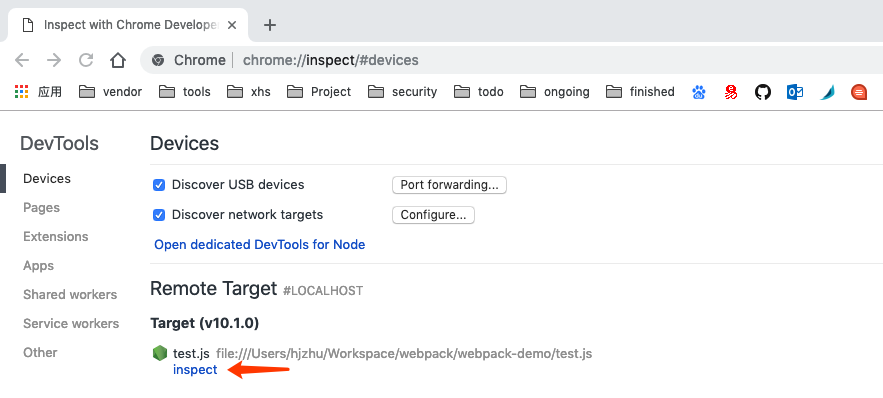
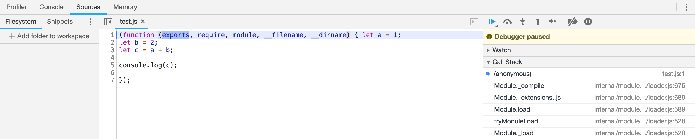
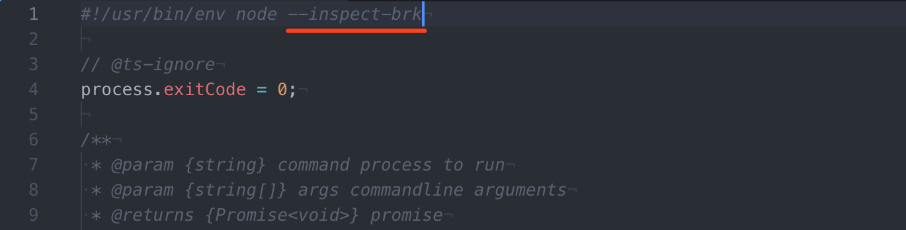

Node调试方法有很多种，在网上可以查到很多（参考 [调试 - 入门指南 | Node.js](https://nodejs.org/zh-cn/docs/guides/debugging-getting-started/)）。本文仅分享自己最常用的Chrome调试方法。

### 启用检查器

可以使用 --inspect 参数来启动检查器。但是这样代码不会停止执行，所以通常使用 --inspect-brk 参数来在用户代码启动前终止，从而利于调试代码。

新建文件test.js，随意输入一段代码：

```
  let a = 1;
  let b = 2;
  let c = a + b;

  console.log(c);
```

在文件目录下运行命令：`node --inspect-brk test.js`

### 使用chrome调试工具调试

打开chrome浏览器，在url中输入 `chrome://inspect`，然后会看到如下界面。



点击inspect开始调试。



现在就可以通过chrome调试工具进行调试了。

### 调试node命令行工具

对于node命令行工具也可以通过以上方法进行调试。只需要将文件地址换成对应的命令行入口文件地址即可。例如运行调试webpack命令，可以找到webpack命令行入口地址。比如我的webpack入口文件地址在

`/usr/local/lib/node_modules/webpack/bin`

所以可以运行命令来启用检查器：

`node --inspect-brk /usr/local/lib/node_modules/webpack/bin/webpack.js`

这里也提供另外一种方法启用检查器。修改开头一行指定脚本的解释程序，添加调试参数`--inspect-brk`。



然后再运行webpack命令的时候就会启用检查器。

后续调试方法跟之前一致。

### 值得注意的地方

这种方法只能用于调试一个进程，当node使用子进程的时候，只有当前进程关联的代码会启用检查器。如果需要调试子进程，需要直接调试子进程关联的代码。
